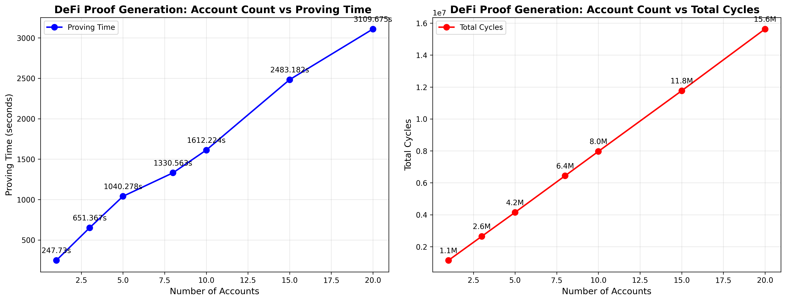
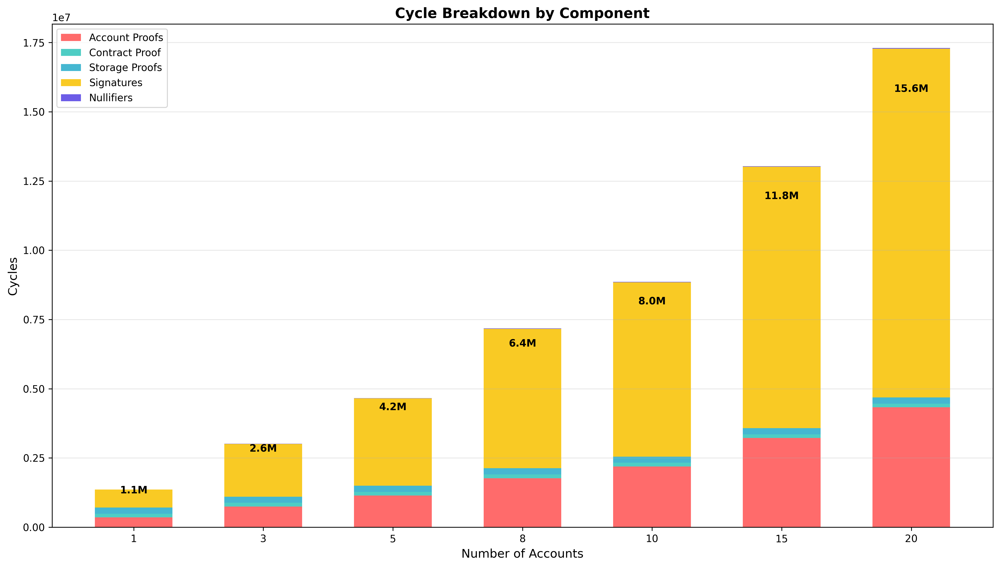
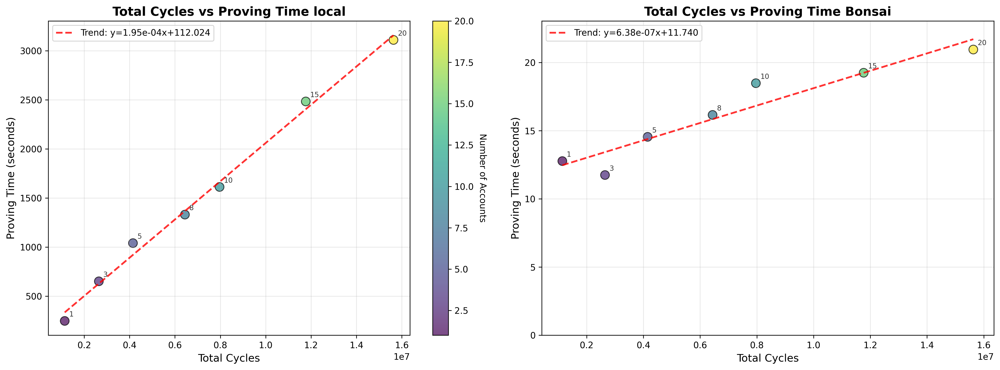
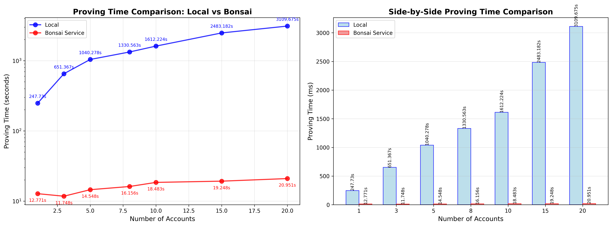

# Evaulation: Defi_inputs_validation proof 
The defi inputs validation proof  is dependent on the number of owned accounts that the user provides to it.
We therefor evaluated the scaling of this proof in relation to the number of provided accounts.
Plots can be viewed in the bottom part of this README

## Evaluation script
To run the evaluation script run 
```bash
EXENV=execution_env_name bash ./evaluate_defi_proofs.sh

```
This will execute defi_inputs_validation proof for following account counts [1 3 5 8 10 15 20]
and store for each run the execution metrics in metrics_execution_env_name/ folder

Per default execution happens locally.
If you want to run the evaluation in bonsain you have to provide the bonsai api key and url in the terminal that executes the script.

## Generating plots.
Based on the collected metrics you can regenerated the plots.
Per default the python file will look for contents of metrics_local and metrics_bonsai.
If your metrics are in other folder you need to adjust the paths provdied to parse_metrics_files() in main.
To run the file:
```bash
# create an virtual env
python3 -m venv venv
# activate it 
source venv/bin/activate 
# install matplotlib 
pip3 install matplotlib

# run the python file to regenerate the plots
python generate_plots.py

```

## Regenerating proof inputs
You can find the inputs for the defi_inputs_validation in the ./evaluation_inputs/ folder. 
Each of the json file names starts with the number of the accounts for witch the input was generated.
NOTE: Before you regenerate the evaulation_inputs you have to deploy contracts from solidity/ folder to local Anvil node or adjust the generate_all_evaluation_inputs()
If you want to regenerate the evaluation_inputs run 
```rust 
cargo run 
```
if you want to adjust the inputs you have to edit the generate_all_evaluation_inputs()
NOTE: per default the inputs are generated based on locally deployed mock lending contract and default Anvil Accounts

# Plots





