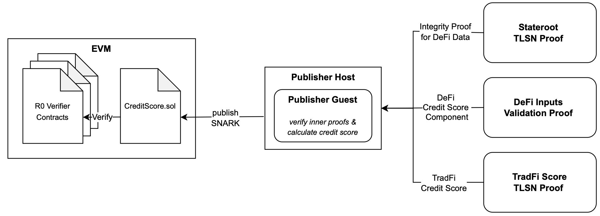
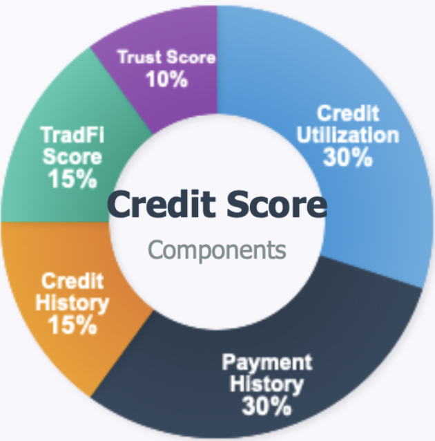

# Zero-Knowledge Based Credit Scoring System

A privacy-preserving hybrid credit scoring system built with RISC Zero that combines traditional financial data (FICO-like scores, fetched with TLSNotary) with on-chain DeFi activity to asses creditworthiness without revealing sensitive financial data.

## Architecture



The system consists of four main components:

- **[Inner Proofs](./risc0_proofs/)**: Individual proofs for different credit factors (fetched TradFi score, DeFi activity assessment and fetched stateroot, for data integrity verification)
- **[Outer Proof](./score_publisher/)**: Aggregated proof that verifies all inner proofs and calculates the final credit score
- **[Smart Contracts](./solidity/)**: On-chain verification and score publishing infrastructure
- **[Custom Libraries](./lib/)**: Shared utilities for zkVM

## Directory Structure
```text
├── lib/                   # Custom libraries and utilities
├── risc0_proofs/          # Standalone RISC Zero proof implementation
├── score_publisher/       # Integrated scoring system with nested proof verification and on-chain publishing
└── solidity/              # Smart contracts for verification and credit score management
└── tee/                   # Score calculation for tee environment (without risc zero)
```
## Hybrid Credit Score Components



The system calculates a weighted composite credit score (300-850 range) using:

- **Payment History (30%)** - DeFi lending reliability and on-time payments
- **Credit Utilization (30%)** - Available credit limits
- **TradFi Score (15%)** - Traditional financial credit score integration fetched from a banking API
- **Credit History (15%)** - Length of DeFi platform interaction history
- **Trust Score (10%)** - Data verification level and proof authenticity (100% here as everything is done in zkVM (compared to alternative aproaches))
